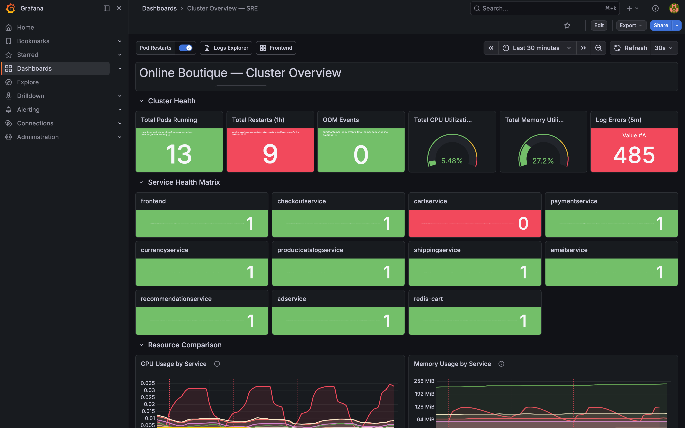
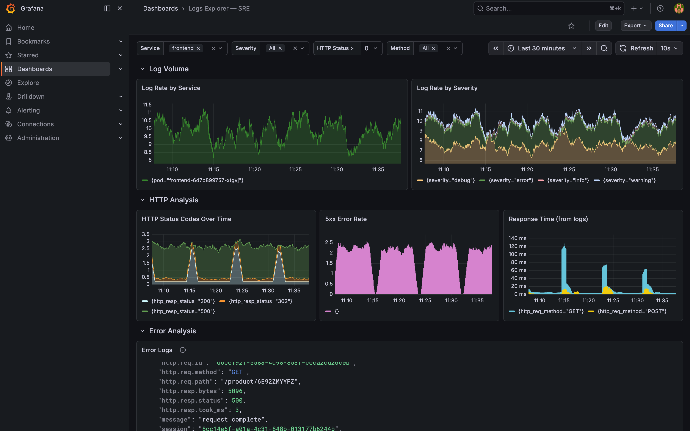
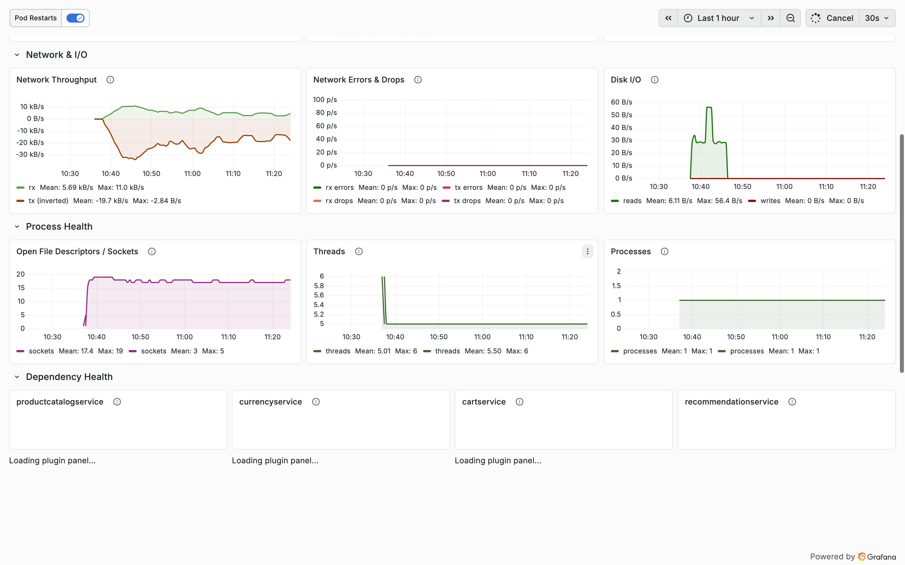
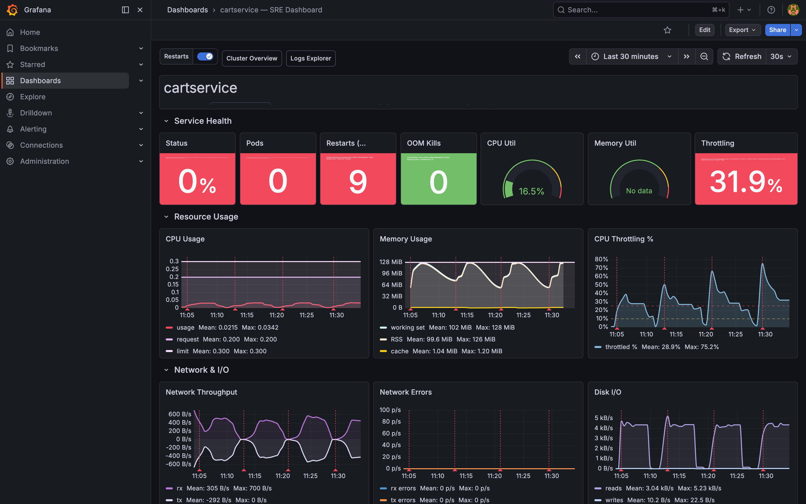

# sre-plugin

Context-aware SRE skills for Claude Code. Works with Prometheus + Loki + Grafana.

> **The key idea:** a `.sre/` directory lives next to your code — a living knowledge base of YOUR infrastructure that every skill reads from and writes to. No hardcoded templates, no hallucinated metric names. The agent discovers your system, learns your baselines, then generates dashboards and investigations using your actual data.

## What makes this different

| Template-based repos | This repo |
|---|---|
| Hardcoded `p99 < 500ms` | Threshold = 2× your actual measured baseline |
| Guesses metric names | Uses only metrics discovered in YOUR Prometheus |
| Single-service view | Topology-aware — traces blast radius across upstream/downstream |
| Stateless | `.sre/` context that persists across conversations |

## Proven on a real cluster

Tested end-to-end against a live kind cluster running [Google Online Boutique](https://github.com/GoogleCloudPlatform/microservices-demo) (11 microservices) with kube-prometheus-stack + Loki. The dashboards below show real cluster data — including a live `cartservice` CrashLoopBackOff incident the dashboards surfaced automatically.

### Cluster Overview — all 11 services at a glance


*13 pods running · 9 restarts (red) · cartservice at 0 replicas (red — real incident) · 485 log errors*

### Logs Explorer — interactive log analysis with 4 template variables


*Filter by service, severity, HTTP status code, and method. Log rate, HTTP status distribution, response time from logs, and error logs with parsed JSON fields.*

### Per-service Dashboard — USE method with baseline-derived thresholds


### Incident surface — cartservice CrashLoopBackOff


*0% status · 0 pods · 9 restarts · 31.9% CPU throttling · sawtooth memory pattern — all from a single `/dashboard cartservice`*

---

## Skills

| Skill | Command | Description |
|-------|---------|-------------|
| **discover** | `/discover` | Crawl Prometheus/Loki/K8s → populate `.sre/` context |
| **dashboard** | `/dashboard <service>` | Generate Grafana dashboard from real metrics + baselines |
| **investigate** | `/investigate <symptom>` | Incident investigation with live data correlation |
| **define-slo** | `/slo <service>` | SLO definition + error budget tracking |
| **tune-alerts** | `/tune-alerts <service>` | Data-driven alert threshold tuning |

## The `.sre/` context directory

Think of it like `.git/` — generated per environment, never committed, read by every skill.

```
.sre/
├── config.yaml          # connection URLs (no credentials — use env vars)
├── topology.yaml        # service dependency graph
├── services/            # per-service metrics, labels, Loki config
├── baselines/           # cpu avg/max, memory avg/max, restart rate
├── incidents/           # incident memory (written by /investigate)
└── dashboards.yaml      # dashboard registry
```

Run `/discover` once after cloning or after infrastructure changes. Everything else reads from `.sre/`.

## Install

**Step 1 — Clone the repo:**
```bash
git clone https://github.com/charles-adedotun/sre-plugin ~/sre-plugin
```

**Step 2 — Copy into the Claude Code local plugin cache:**
```bash
mkdir -p ~/.claude/plugins/cache/local/sre-skills/1.0.0
cp -r ~/sre-plugin/. ~/.claude/plugins/cache/local/sre-skills/1.0.0/
```

**Step 3 — Register in `~/.claude/plugins/installed_plugins.json`:**

Open the file and add an entry to the `"plugins"` object:
```json
"sre-skills@local": [
  {
    "scope": "user",
    "installPath": "/Users/YOUR_USERNAME/.claude/plugins/cache/local/sre-skills/1.0.0",
    "version": "1.0.0",
    "installedAt": "2026-01-01T00:00:00.000Z",
    "lastUpdated": "2026-01-01T00:00:00.000Z"
  }
]
```

Replace `YOUR_USERNAME` with your macOS username (`whoami`).

**Step 4 — Restart Claude Code.** The `/discover`, `/dashboard`, `/investigate`, `/slo`, and `/tune-alerts` commands will be available.

## Quick start

```bash
export PROMETHEUS_URL=http://localhost:9090
export LOKI_URL=http://localhost:3100       # optional
export GRAFANA_URL=http://localhost:3000    # optional
export GRAFANA_PASSWORD=your-password       # optional
export GRAFANA_LOKI_UID=your-loki-uid       # find in Grafana → Connections → Data sources

# In Claude Code:
/discover                        # index your infrastructure → populates .sre/
/dashboard frontend              # generate + push a Grafana dashboard
/investigate "high error rate"   # diagnose with live data
/slo payment-service             # define SLOs and error budgets
/tune-alerts cartservice         # data-driven threshold recommendations
```

## Requirements

- **Prometheus** (required)
- **Loki** (optional — enables log panels and log-based investigation)
- **Grafana** (optional — enables dashboard push and registry)
- **kubectl** (optional — enables topology discovery via env var inspection)

## Examples

`examples/sre/` — sample `.sre/` context files from an Online Boutique demo cluster. Shows the schema the skills produce and consume, including a `cartservice` baseline with `null` memory (captured during a CrashLoopBackOff incident).

`examples/dashboards/` — Python scripts that generated the dashboards shown in the screenshots above. Hardwired to Online Boutique — useful as a reference or starting point. Configure via env vars:

```bash
export GRAFANA_LOKI_UID=<your-loki-uid>    # find in Grafana → Connections → Data sources → Loki
export SRE_NAMESPACE=online-boutique
python3 examples/dashboards/online-boutique-dashboards.py
```

## Notes

- `/investigate` uses `model: claude-opus` for multi-step live data correlation. Requires Opus access.
- The `GRAFANA_LOKI_UID` is instance-specific. Without it, log panels show "No data". Find it at Grafana → Connections → Data sources → Loki → the UID is in the page URL.
- `/discover` must run before other skills. Re-run after infrastructure changes.
